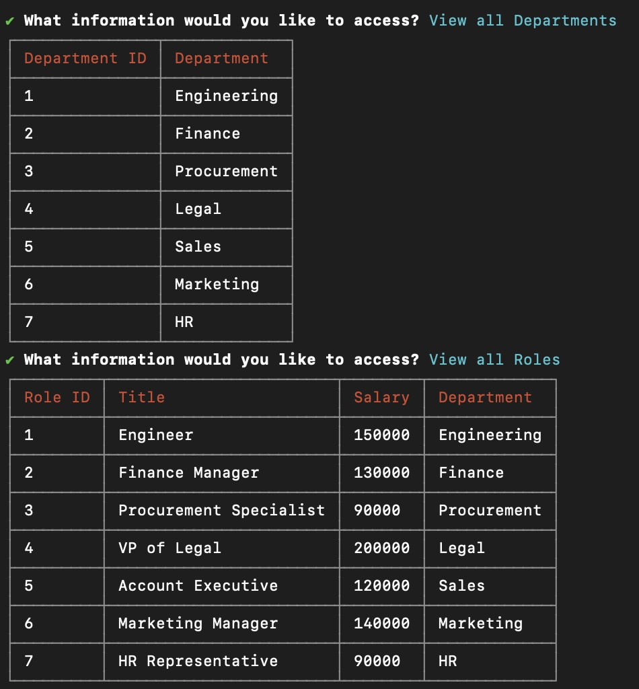
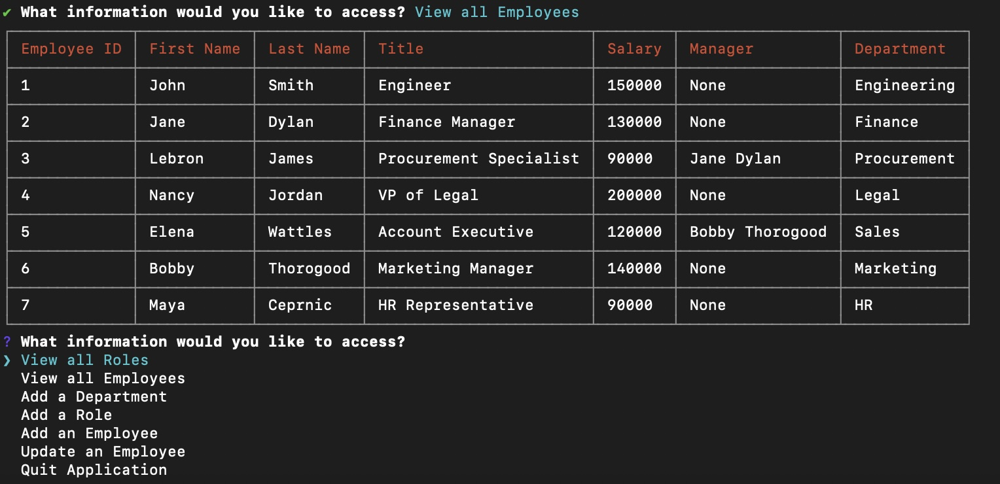

# Employee Tracker App

## Description
This app helps you track the employees, their roles, their managers and the departments at your company. You can add new departments, roles and employees. And, you can also update an employee record. More features will be pushed like updating additional records and deleting them.

## Usage
This app is accessed through the command line using the 'npm run build' and 'npm run start' commands. 

Please have a look at the demo video for a walkthrough: 
[Demo Video](https://drive.google.com/file/d/15JP-_EeoE1u1i_LH4n1hetNsgiJW7F-A/view?usp=drive_link)

Screenshot 1:  
  

Screenshot 2:  
  

## Technical Features

Typescript and Node.js are part of the stack, as well as PostgreSQL. The app uses the npm packages inquirer, pg for postgreSQL, and cli-table3 for an improved table visualization.

## Credits & How to Contribute
This app was created by Johann Zaroli. Please contact me on GitHub at Jzaroli with any questions or requests.

## License
MIT License

Copyright (c) <2024>

Permission is hereby granted, free of charge, to any person obtaining a copy of this software and associated documentation files (the "Software"), to deal in the Software without restriction, including without limitation the rights to use, copy, modify, merge, publish, distribute, sublicense, and/or sell copies of the Software, and to permit persons to whom the Software is furnished to do so, subject to the following conditions:

The above copyright notice and this permission notice shall be included in all copies or substantial portions of the Software.

THE SOFTWARE IS PROVIDED "AS IS", WITHOUT WARRANTY OF ANY KIND, EXPRESS OR IMPLIED, INCLUDING BUT NOT LIMITED TO THE WARRANTIES OF MERCHANTABILITY, FITNESS FOR A PARTICULAR PURPOSE AND NONINFRINGEMENT. IN NO EVENT SHALL THE AUTHORS OR COPYRIGHT HOLDERS BE LIABLE FOR ANY CLAIM, DAMAGES OR OTHER LIABILITY, WHETHER IN AN ACTION OF CONTRACT, TORT OR OTHERWISE, ARISING FROM, OUT OF OR IN CONNECTION WITH THE SOFTWARE OR THE USE OR OTHER DEALINGS IN THE SOFTWARE.